# roman-numeral-converter

**roman-numeral-converter** is a java based spring-boot application that exposes a GET based REST API to convert integer
into it's respective roman numeral representation.
> Developed by: Saravanesh Selvaraj

## Table of Contents

- [Frameworks and Technologies Used](#frameworks-and-technologies-used)
- [Architecture](#architecture)
- [Packaging Layout](#packaging-layout)
- [How to build and deploy the stack?](#how-to-build-and-deploy-the-stack)
- [Setting up the Environment](#setting-up-the-environment)

## Frameworks and Technologies Used

* Java 11
* spring-boot
* Maven
* Junit 5
* Mockito
* ELK (ElasticSearch, Logstash, Kibana)
* Prometheus
* Grafana
* Docker

## Architecture

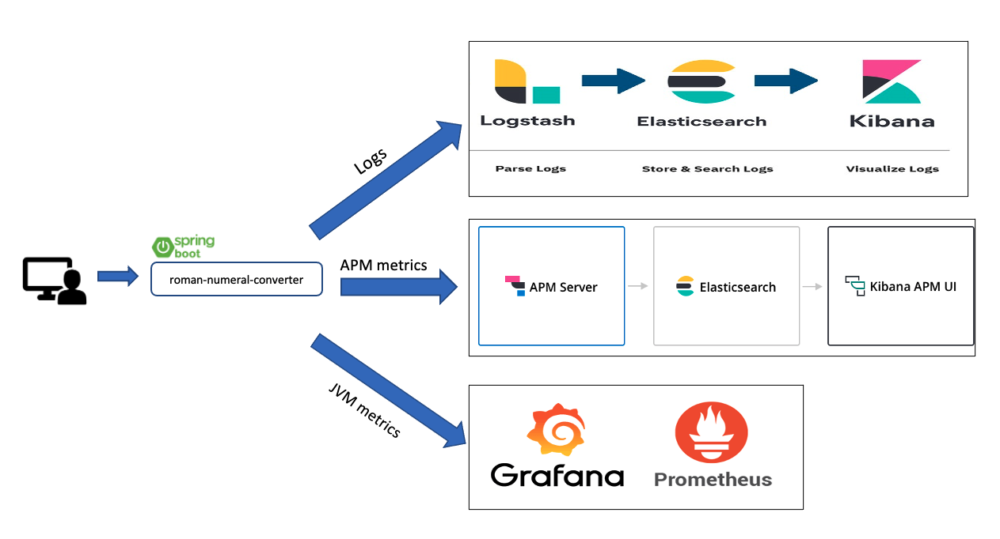

## Packaging Layout

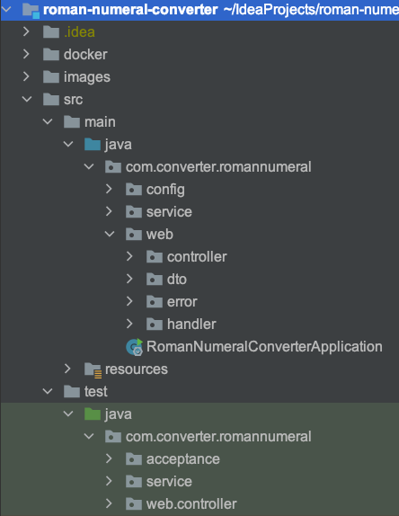

## How to build and deploy the stack?

1. Clone the git repo

```
git clone https://github.com/sashrepo/roman-numeral-converter.git
```

2. Pre-requisite checks for required frameworks

```
java -version
docker -v
docker-compose -v
mvn -v
```

3. For convenience to run the application, I have bundled all the required commands in one shell script, you can just
   run the shell script or run individual commands in the shell script by yourself to start the whole application stack
   along with the devops capabilities as shown in the architecture diagram,

```
cd docker
sh runWholeStack.sh
```

the shell script, first runs a maven package command and then uses docker compose to spin the whole docker infra. The
whole process should take around 2 to 3 mins depending on the underlying machine, you should see a similar output as
shown below with status of various services,
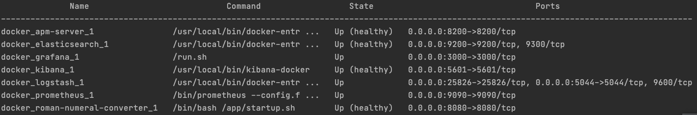
Use the below command to refresh the status of the services until you see all the services Up and elasticsearch, kibana
and apm server reported as Up (healthy)

```
docker-compose -f docker-compose.yml ps
```

4. Verify if the deployed services are up and running,

> roman-numeral-converter App - http://localhost:8080/actuator/health
>
> REST API specs - http://localhost:8080/swagger-ui.html
>
> APM Server - http://localhost:8200/
>
> Elasticsearch - http://localhost:9200/
>
> Kibana - http://localhost:5601/
>
> Prometheus - http://localhost:9090/
>
> Grafana - http://localhost:3000/

5. To run the application in stand-alone mode without any devops capabilities, just run
   the `RomanNumeralConverterApplication` class

## Setting up the Environment

### Kibana setup

#### Viewing logs in Kibana

> http://localhost:5601/

1. You should see Kibana home screen like this,
   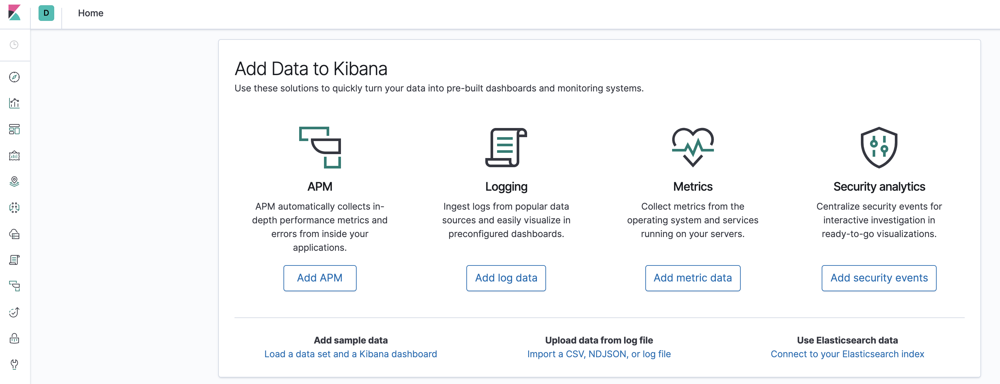

2. Create index pattern `logstash-*` to visualize logs as shown below,
   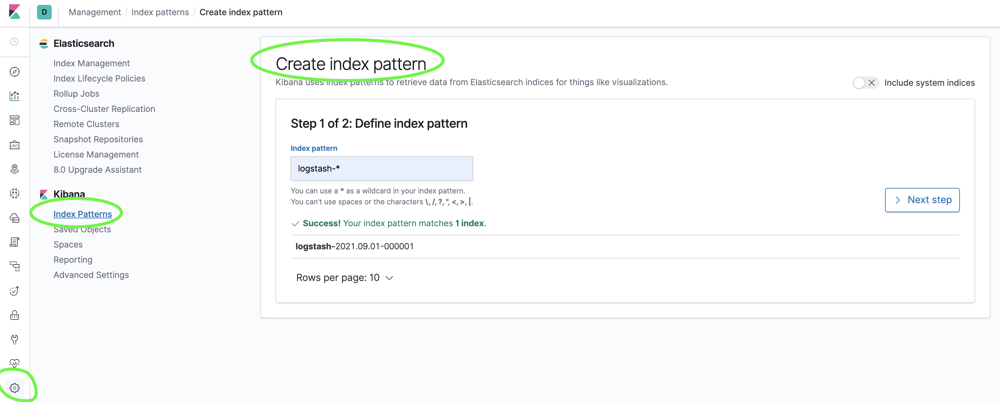

3. After configuring the index-pattern, go to discover to check the application logs,
   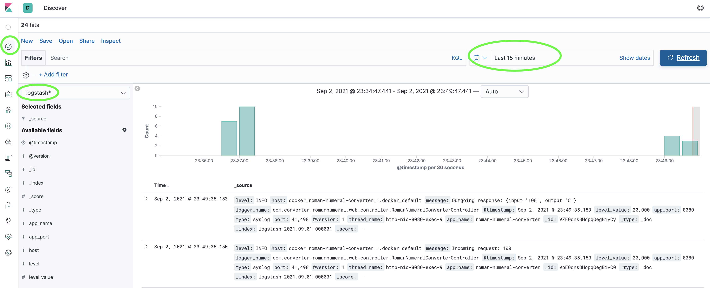

#### Viewing APM(Application Performance Metrics) in Kibana

> http://localhost:5601/app/apm

Select roman-numeral-converter to view it's APM,
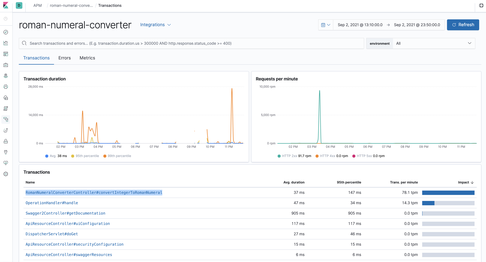

### Grafana setup

> http://localhost:3000/

1. Default username/password for Grafana is admin/admin, you might want to setup a new password when logging in for the
   first time. After logging in, you should see a home screen like below, Select `Add your first datasource`,
   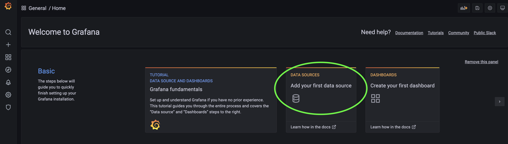

2. Select Prometheus from the list of datasources,
   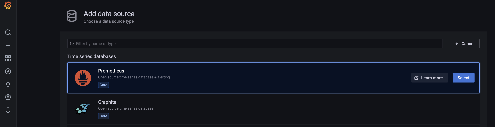

3. Configure Prometheus datasource as shown below,  http://prometheus:9090
   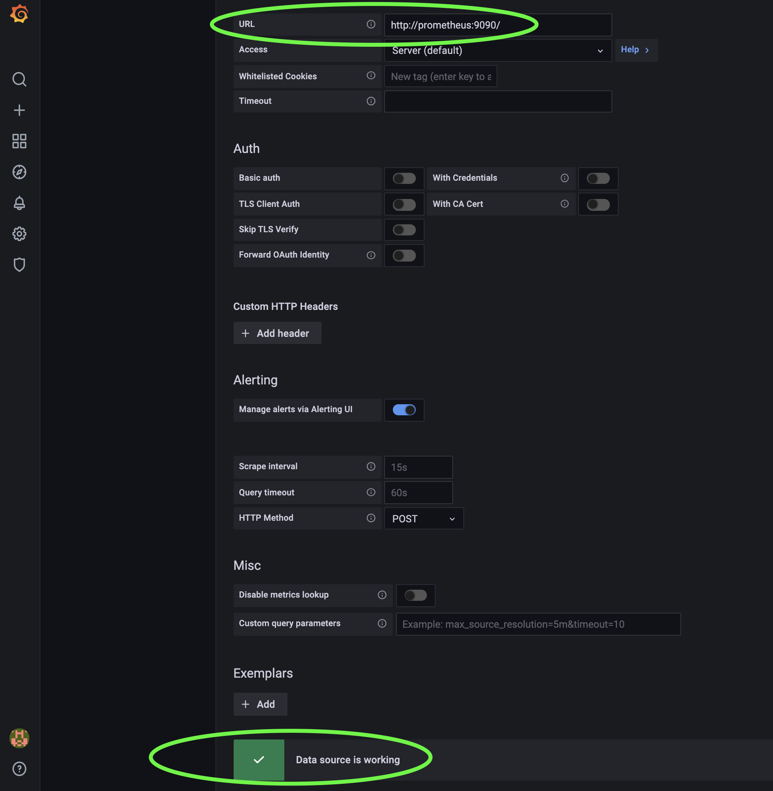

4. Import dashboard template as shown in below screenshots,
   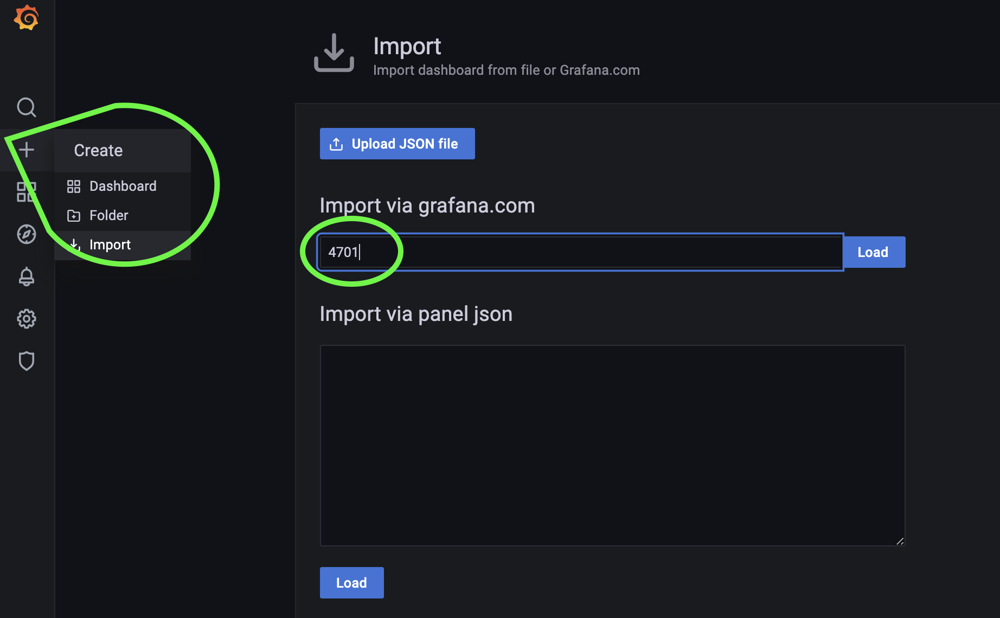
   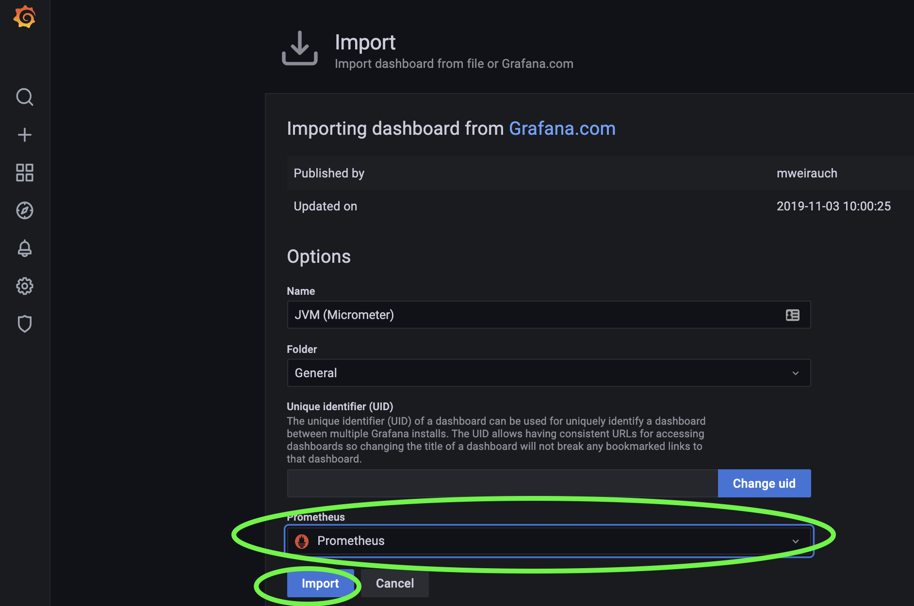

5. Once it is loaded, Grafana dashboard will be up and running with JVM metrics as shown below,
   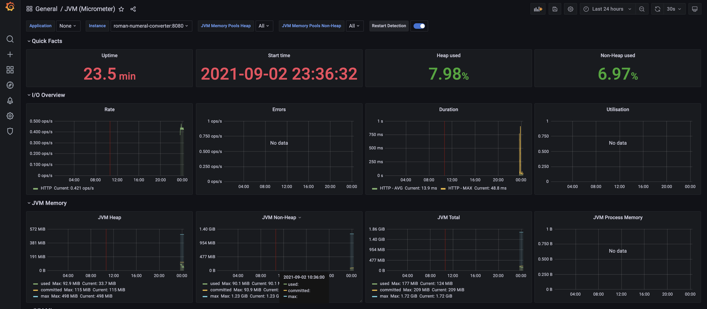

## Testing

### Health check

> http://localhost:8080/actuator/health

### Sample test

> http://localhost:8080/romannumeral?query=3999

Output:

```
{
"input": "3999",
"output": "MMMCMXCIX"
}
```

### Run Unit/Integration tests

From application root directory, run
> mvn clean install

```
Test Cases:

RomanNumeralConverterControllerTest
- convertIntegerToRomanNumeral_Success - Happy day flow
- convertIntegerToRomanNumeral_lessThanMinError - input number less than min value < 1
- convertIntegerToRomanNumeral_greaterThanMaxError - input number greater than max value > 3999
- convertIntegerToRomanNumeral_inputTypeMismatchError - input value not a valid int number - eg: String value like "plsFail"
- convertIntegerToRomanNumeral_internalServerError - simulating RuntimeException

RomanNumeralConverterServiceImplTest
- convertIntegerToRomanNumeral_Success - multiple happy day assertions

```

### Run Acceptance tests

1. Acceptance tests that can be integrated into the CI/CD pipeline with test cases required to certify the application
   ready for deployment to next stage
2. For this, make sure the application is running, because these tests are executed against the running application,
   simulating a real world flow
3. Use the below command, to run the acceptance tests,

> mvn test -Dtest=IntegerToRomanNumeralConversionAT

```
Acceptance Test Cases

IntegerToRomanNumeralConversionAT
- testDefaultContentTypeIsJson - Validate response content type is application/jso
- testIntegerToRomanNumeralConversion_Success - Happy day case to validate conversion of a valid int to roman numeral
- testIntegerToRomanNumeralConversion_ValidationError_OutOfRange - Error case to validate out of range conversions. Valid range 1 to 3999
- testIntegerToRomanNumeralConversion_ValidationError_InvalidDataType - Error case to validate invalid data type inputs. Valid data type int, range 1 to 3999
```


   


